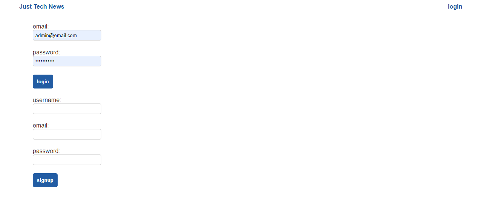
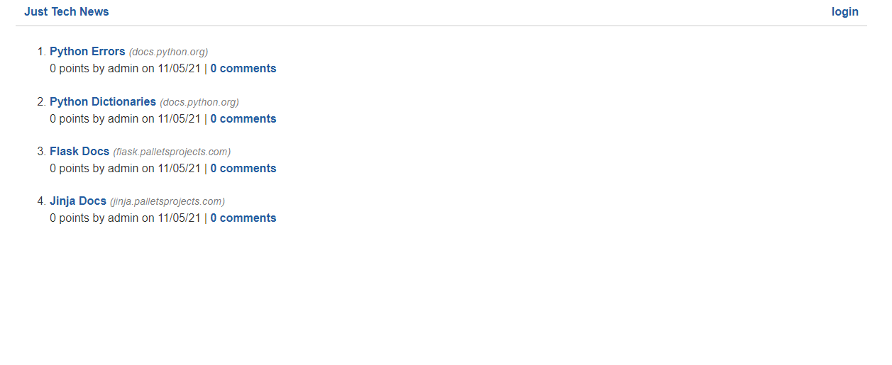
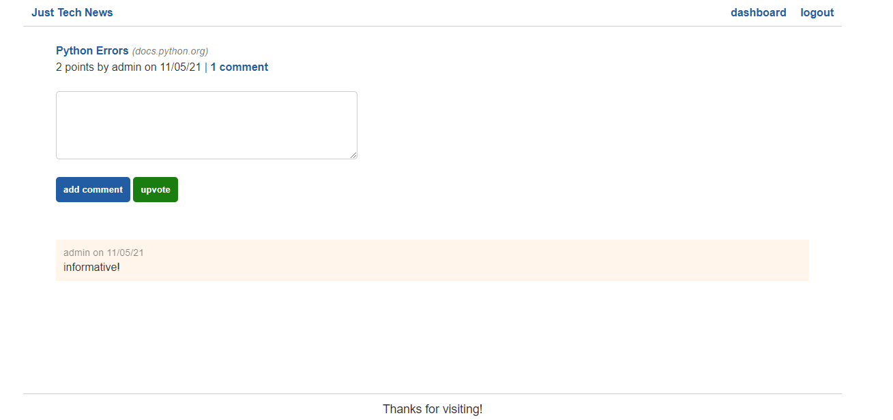

# python-newsfeed

## Description:
This app is a MVC structured tech-blog with a backend built mostly with Python. This structure is strikingly similar to an all javascript MVC app. This app utilizes user login, sessions, encrypts the password stored, and allows the user to post a title with a link, comment on said post, edit said post, delete said post, and upvote said post. The db is mySQL locally, using jawsDB in heroku in production.

## Technologies Utilized:
- HTML, CSS, JavaScript, Python
- pip
- Jinja templating
- Flask for local server testing
- bcrypt for password encryption
- mySQL, SQLAlchmey, PyMySQL and Gunicorn for DB, locally and in production
- dotenv
- Heroku for deployment

## Use
- When installing dependencies locally, ensure you are in a virtual environment, pip installs dependencies globally otherwise!

## Screenshots:

## Challenges & Thoughts:
- I found that my machine was not allowing me to run scripts from powershell, so I had trouble setting up the virtual environments to install my dependencies via pip. I found the answer on stack-overflow very quickly, changing the execution policy of my machine allowed powershell to have permission to run scripts and circumvent this issue.

- I found myself enjoying Python. It felt cleaner and more semantic to me than a similar app in javascript. I enjoyed going outside of bash, utilizing scripts and virtual environments for this lesson. There is clearly a similarity between Python and JavaScript in how these app is structured, and even some of the syntax is quite similar. It gave me some confidence in branching out into other languages concerning building backend applications. Applying much of what i've learned through JavaScript, it seems learning structure, flow and how everything connects and accesses each other is more crucial than the syntax itself.

## Questions/Links:
https://github.com/MarkAndersen
 
https://python-newsfeed-lesson.herokuapp.com/
 
[Email me](mailto:Mark.Andersen75@gmail.com)